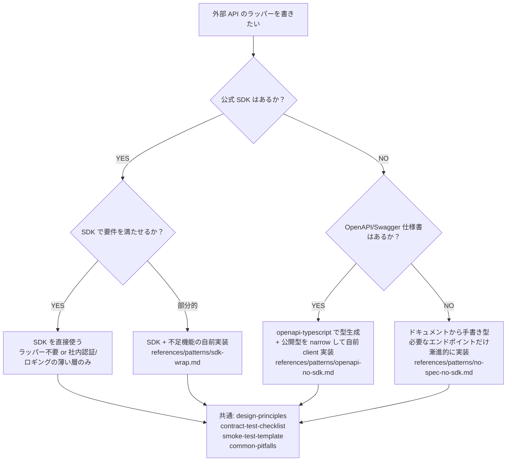

# 外部 HTTP API ラッパー設計 skill

外部 API（Stripe / Notion / Slack / GitHub / OpenAI / 自社 API 等）を TypeScript から呼び出すためのモジュールを設計・実装する際の、選定フロー + 共通原則 + パターン別ガイド。

## 言語スコープ

**対象言語**: TypeScript / JavaScript（Node.js / browser / Bun / Deno / Edge runtime）

**対象外**: Python / Go / Rust / Java / Kotlin / Ruby / PHP / Swift / C# 等

このスコープは「OpenAPI なら TypeScript が良い」という命題に基づくものではなく、**Mazrica Phase 1 の実プロジェクト経験を起点にしたため**。OpenAPI 型生成は多言語で利用可能（Python の `datamodel-code-generator`、Go の `oapi-codegen`、Java の `openapi-generator` 等）であり、言語選定はプロジェクトのチームスキル・既存資産・デプロイ環境次第。

### 他言語のラッパーを書く場合の扱い

- **思想（DI 境界 / 公開型と生成型の分離 / silent failure 禁止 / メソッド別 contract / 過剰抽象禁止）は流用可能**: `references/design-principles.md` は概ね言語非依存
- **具体的なツール選定・コード例は適用不可**: `openapi-typescript`, `vitest`, `commander`, `pnpm workspace` 等は TS/JS 専用
- 必要になったら以下の選択肢:
  - 別 skill を作る（例: `external-api-wrapper-design-python`）
  - 本 skill の `references/patterns/` に他言語パターンを追加する
- 現状は「TS/JS 以外のラッパー設計時は本 skill を発火させない」運用

## なぜこの skill が要るか

「外部 API を叩く」だけの単純な仕事に見えても、実際には繰り返し同じ落とし穴が現れる：

- **公式 SDK があるのに無視して自前 client を書く**（または逆に、SDK で済むのに薄いラップを過剰に被せる）
- **副作用が暗黙化する** (`process.env` や top-level `fetch` を直接掴んでテスト不能になる)
- **型と現実のズレ**（OpenAPI optional 宣言の field が実 API では `null`、required でない field が実は常に来る）
- **silent failure**（欠落要素を黙って除外して呼び出し側がデータ欠損に気付けない）
- **メソッド別 contract の混同**（GET の前提を PUT/PATCH に一般化して致命的バグ）
- **mock の限界の見落とし**（contract test 緑 ＝ 動く、と誤認）

skill として固定することで、新しい API ラッパーを追加するたびに同じ落とし穴を繰り返すのを防ぐ。

## 1. 選定フロー（最初に必ず通す）



### 判断基準の補足

**公式 SDK の有無確認:**
- npm に `<vendor>/<service>` 系パッケージが提供されているか（例: `stripe`, `@notionhq/client`, `@slack/web-api`, `@octokit/rest`, `openai`）
- 提供されているなら基本それを使う方針で検討する。「自前で書きたい」を優先しない

**SDK で要件を満たせるか:**
- 認証フロー / 必要なエンドポイント / エラー型 / リトライ戦略が揃っているか
- 社内固有要件（社内認証層を噛ませたい、独自ロギング、独自リトライ、テナントごとの API キー切替）があるか
- これらが SDK で完結するなら **直接使う**。社内固有要件があるなら **薄いラップ層**を被せる

**OpenAPI の有無確認:**
- 公式ドキュメントに OpenAPI/Swagger spec があるか
- なければ手書きで必要な型だけ定義していく

## 2. 共通原則（パターン横断）

各パターンに進む前に、以下の reference を読む（パターン非依存）：

| reference | 読むタイミング |
| --- | --- |
| `references/design-principles.md` | 設計前に必ず（DI 境界 / 公開型と生成型の分離 / silent failure 禁止 / メソッド別 contract / 過剰抽象禁止） |
| `references/contract-test-checklist.md` | 実装時にテストを書きながら |
| `references/smoke-test-template.md` | 実装後・PR 前に実 API で確認するためのテンプレ |
| `references/common-pitfalls.md` | 過去の指摘集積。レビュー前の self-check に |

## 3. パターン別ガイド

選定フローで進んだ先のパターンに応じて、`references/patterns/` 配下を読む：

| パターン | reference | 典型例 |
| --- | --- | --- |
| **SDK 利用 / 薄いラップ** | `references/patterns/sdk-wrap.md` | Stripe / Notion / Slack / OpenAI / GitHub |
| **OpenAPI あり / SDK なし** | `references/patterns/openapi-no-sdk.md` | 自社 Open API、Mazrica、Sansan、kintone 等で SDK が無いケース |
| **OpenAPI も SDK もなし** | `references/patterns/no-spec-no-sdk.md` | レガシー API、社内 SSE エンドポイント、ドキュメントが断片的なケース |

## 4. 中核思想（要約）

詳細は `references/design-principles.md` だが、ここに最重要 3 点：

1. **「テストが書けない構造 ＝ 設計が悪い」**: 副作用（fetch / env / stdout）を引数で外から注入できるなら、自然に純粋関数と I/O が分離する。これは TDD の儀式ではなく、テスト可能性そのものが依存方向を強制する効果。
2. **「中核は client、interface は付け替え可能」**: API ラッパー本体は `apiKey / fetch` を受け取る pure な module にする。CLI / MCP / Skill / Web UI / Chrome 拡張 / バッチ は全て**外側の interface 層**で、後から付け替え・追加できる。最初から interface に紐付かない設計にする。
3. **「silent failure 禁止」**: 不完全なデータを除外したら除外件数を `warnings` で呼び出し側に伝える。「親切な処理」に見えて、観測不能な情報損失を作るのが最も保守困難な負債になる。

## レイヤー設計

```text
[interface 層]  CLI / MCP / Skill / Web UI / Chrome 拡張 / バッチ
       ↓
[Use Case 層]   service module（複数 client メソッドの組み合わせ業務操作。Phase 1 では空でもよい）
       ↓
[Gateway 層]    client module（SDK 直接利用 or SDK ラップ or 自前実装。本 skill の主対象）
       ↓
              External API
```

依存方向は **外側 → 内側のみ**。client は CLI を知らない、service は CLI を知らない、を不変条件にする。Phase 1 の最初から service 層を作る必要はない（YAGNI）。多段オーケストレーションが現れた時点で service 層が立ち上がる。

## 関連 rule / skill

- `~/.claude/rules/testing.md` — Contract-first / Regression-first テスト方針、「テスタビリティ ⇄ レイヤー分離」セクションが本 skill の理論基盤
- `~/.claude/rules/neutral-evaluation.md` — 技術選定で片方に加担しない（「SDK を使うべき」「自前で書くべき」を勝手に断定しない）
- `~/.claude/rules/failure-feedback.md` — この skill 自体が「2 度繰り返した失敗を仕組みに戻した」結果
- `adr` skill — このプロジェクトに固有の設計判断（SDK 採用 vs 自前実装、公開型と生成型の分離 等）は ADR に記録する
- `~/.claude/INVENTORY.md` — エコシステム全体の俯瞰
