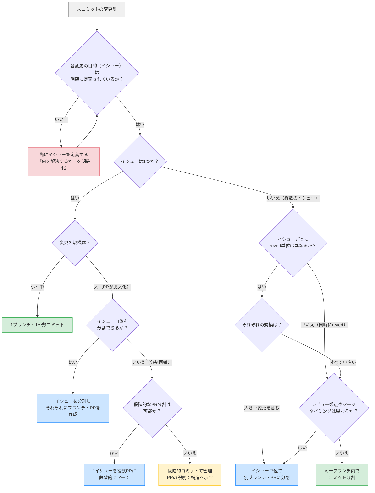
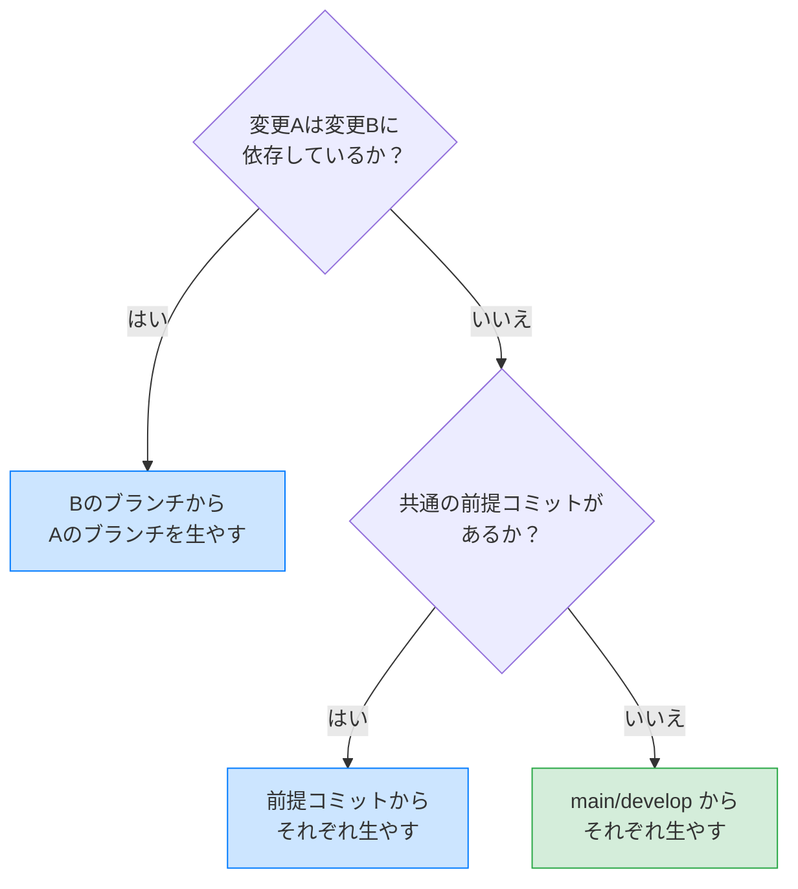

# ブランチ設計の判断フロー

変更をブランチ・コミットに分割する際の判断フロー。

## 前提: イシュー・ブランチ・PR・コミットの関係

**基本原則: 1ブランチ = 1PR**。プロジェクト固有のブランチ戦略がある場合はそちらを優先する。

| 概念 | 役割 | 粒度 |
| --- | --- | --- |
| **イシュー** | 何を解決するか（目的の定義） | 独立して完了・検証できる単位 |
| **ブランチ** | 作業の実行単位 | 1PRに対応 |
| **PR** | レビュー・マージの単位 | 1ブランチに対応 |
| **コミット** | 変更の記録単位 | revert 可能な段階的記録 |

イシューとブランチは1対1とは限らない。小〜中規模なら1イシュー = 1ブランチだが、大きいイシューは複数のブランチ・PRに分かれることがある。逆に、複数イシューを1ブランチにまとめるのは避ける。

規模が大きい変更に直面したとき、「ブランチをどう分けるか」から考えるのではなく、**「イシューとして目的を定義し、独立してレビューできるPR単位に分割できないか」** を先に検討する。

## 判断フローチャート

## 判断の要約

| 条件 | 判断 |
| --- | --- |
| イシューが未定義 | 先にイシューを定義する |
| 1イシュー・規模が小〜中 | 1ブランチ・コミット分割 |
| 1イシュー・規模が大・イシュー分割可能 | イシューを分割し別ブランチ・PR |
| 1イシュー・規模が大・PR分割可能 | 1イシューを複数PRに段階的にマージ |
| 1イシュー・規模が大・分割困難 | 段階的コミットで管理 |
| 複数イシュー・revert単位が違う | イシュー単位で別ブランチ・PR |
| 複数イシュー・revert単位が同じ | レビュー/マージ観点で判断 |

## 分岐元の選択

