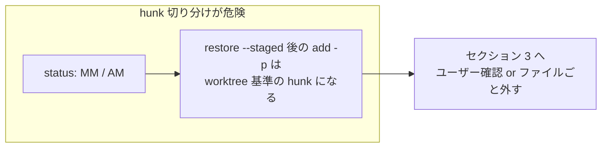
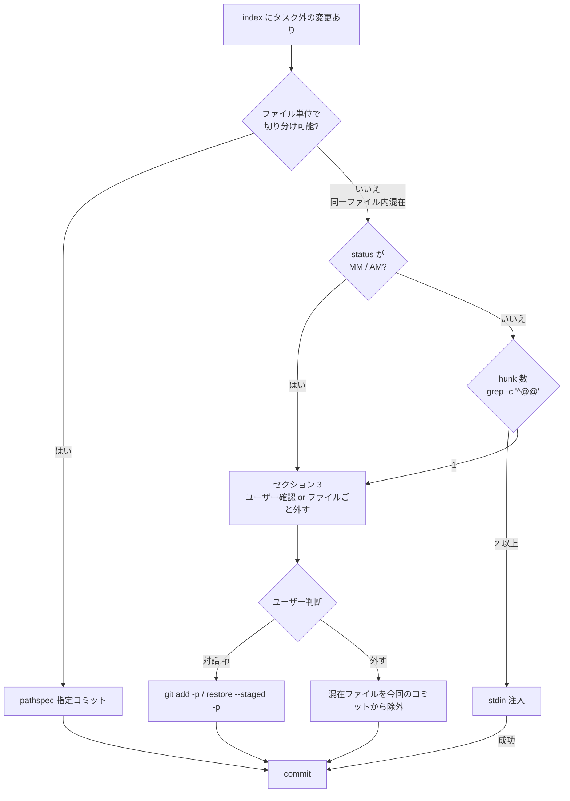
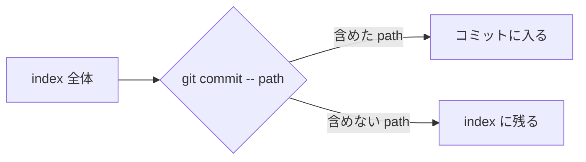
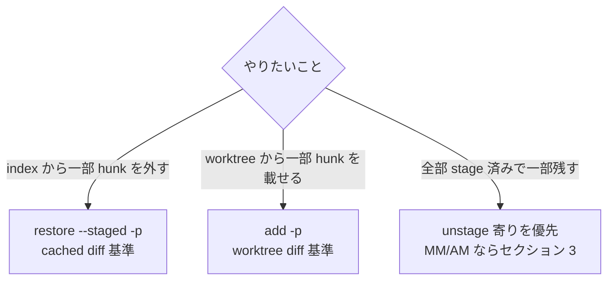
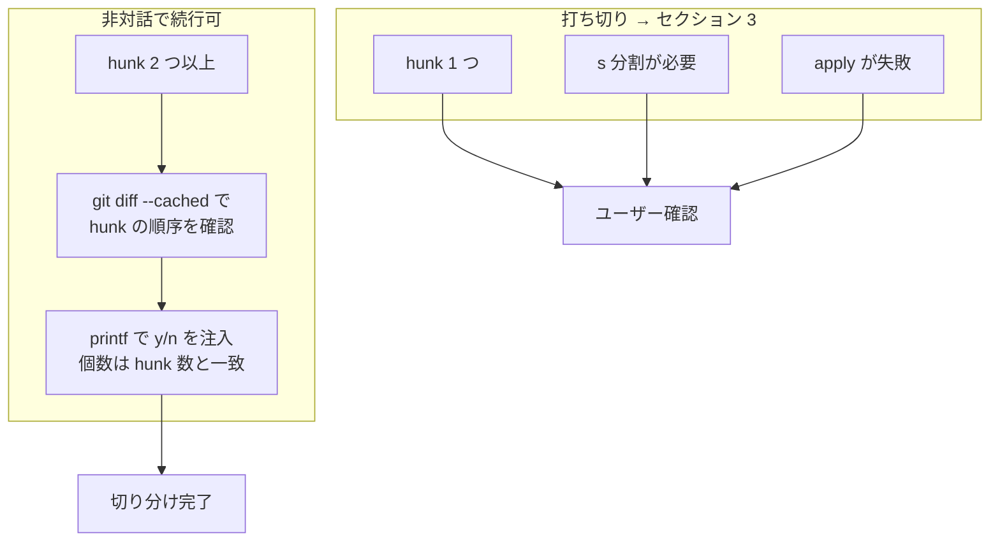

# コミット対象の切り分け・隔離

自分のタスク外の変更がコミットに巻き込まれるのを防ぐ。`git switch -c <new>` で新規ブランチを切っても index は持続するため、ブランチ作成だけでは隔離されない。

## コミット前の確認

`git status --short` の **左列（index 列）** を確認し、今回のタスクと無関係なパスがステージされていないか見る。

| 表示 | 意味 |
| --- | --- |
| `A ` / `AM` | 新規ファイルが index に add 済み |
| `M ` / `MM` | 既存ファイルの変更が index に add 済み |
| `D ` | 削除が index に add 済み |

特に注意するサイン：

- 自分が触っていないディレクトリ階層のファイルがステージされている
- `AM` / `MM`（index と worktree で別状態のファイル）が混在
- セッション開始前から残っていた可能性のあるファイル

### `AM` / `MM` 状態の注意

`AM` / `MM` は index と worktree で内容が異なる。`git restore --staged <file>` → `git add -p` の流れでは、**unstage 後は worktree 基準の hunk** になるため、元の index 内容と一致しないことがある。



この状態では hunk 単位の非対話切り分けを試さず、判断フローの `MM / AM` 分岐どおりセクション 3 へ進む。

### 具体例: 同一ファイル内の混在

`src/foo.ts` にタスク A（今回）とタスク B（別セッション）の変更が両方 index にある場合:

- `git commit -- src/foo.ts` → **タスク B の hunk も全部入る**（pathspec ではファイル内を切れない）
- 対処: hunk 数が 2 以上なら stdin 注入、1 ならユーザーに `-p` を依頼するか、今回は `foo.ts` をコミット対象から外す

## 用語と粒度

切り分け手段は **pathspec（path 単位）** と **hunk（ファイル内の差分ブロック単位）** に分かれる。

| 手段 | 単位 | index を触る | 非対話 |
| --- | --- | --- | --- |
| pathspec | ファイル／ディレクトリ | 触らない | 可 |
| hunk 選択（stdin 注入） | 差分ブロック（`@@` 単位） | 触る | 可（hunk 2 つ以上） |
| パッチ編集 + `git apply --cached` | 手動で行まで | 触る | 高難度・最終手段 |
| 対話 `-p`（`s` / `e`） | hunk → 行に近い | 触る | 不可（人間向け） |

- **pathspec**: `git commit -- <path>` でコミット対象の path を指定する。同一ファイル内の一部だけは切れない。
- **hunk**: `git diff` の `@@ ... @@` で区切られる連続した変更ブロック。`-p` のデフォルト操作は hunk 単位。`s`（分割）や `e`（編集）で行に近い粒度にできるが、非対話では困難。

```mermaid
graph TB
  subgraph granularity [切り分けの粒度]
    P[pathspec<br/>ファイル / ディレクトリ]
    H[hunk<br/>@@ で区切られた差分ブロック]
    L["対話 -p の s / e<br/>行に近い粒度"]
  end
  P -->|粗い・非侵襲| C[commit]
  H -->|中・index 操作が要る| C
  L -->|細かい・人間向け| C
```

## 巻き込みが見つかった際の対処パターン

次の順で検討する。



### 1. pathspec 指定コミット（第一選択）

**適する場合**: コミット対象の path がファイル／ディレクトリ単位で切れる。混入 path が複数ファイルにまたがっても、対象 path を列挙すれば足りる。

**なぜ第一選択か**: 他作業の index を一切触らないため、最も非侵襲。

```sh
git commit -m "..." -- <path>...
```

#### pathspec 指定コミットの注意点

- `--` 区切りを必ず置く（オプションとパスの解釈を明示的に分ける）
- pathspec に含めたパスについては、index にあるモード変更（chmod 等）も取り込まれる
- pathspec はディレクトリ単位の指定も可能（例: `-- docs/`）

#### pathspec の挙動



- pathspec に**含めない** path は index に残り、コミットされない（他作業の staged 変更を壊さない）
- pathspec に**含めた** path は index の内容がそのまま入る（worktree の未 stage 分は入らない）
- pathspec なしの `git commit` は **index 全体**が対象になる

### 2. hunk 単位の切り分け（pathspec では不可）

**適する場合**: 同一ファイル内で、コミット対象の hunk と対象外 hunk が index に混在している。pathspec は path 単位までしか切れない。

**手順**: 切り分えが必要と判断したら、次を順に試す。`git add -p` 等をそのまま実行すると入力待ちで止まるため、stdin 注入か `git apply --cached` で非対話化する。

1. **hunk 数を確認** — `git diff --cached <file> | grep -c '^@@'`。`1` なら変更が 1 hunk にまとまっている。stdin 注入では分割できない。
2. **stdin 注入** — hunk が 2 つ以上あるとき。`printf` で `y` / `n` を流し込む。
3. **`git apply --cached`** — 載せたい hunk だけのパッチを当てる。1 hunk にまとまっているときはパッチ編集で分割する。

| 状況 | やりたいこと | コマンド例 |
| --- | --- | --- |
| 全部 stage 済み、一部 hunk だけ外したい | unstage | `printf 'n\ny\n' \| git restore --staged -p <file>` |
| 未 stage から一部 hunk だけ載せたい | stage | `printf 'y\nn\n' \| git add -p <file>` |
| 全部 stage 済み、一部だけ残したい | unstage 寄り | 上の unstage を使う（`restore --staged` → `add -p` は worktree 基準になるため注意） |



| 手段 | 検証結果 |
| --- | --- |
| stdin 注入（unstage） | 2 hunk 以上なら、指定 hunk だけ index から外れる |
| stdin 注入（stage） | 2 hunk 以上なら、指定 hunk だけ index に載る |
| `git apply --cached` | 対象 hunk だけ staged になり、残りは worktree に残る（パッチ編集が要る） |

#### 非対話での難易度と打ち切り基準



| 状況 | 難易度 | エージェントの方針 |
| --- | --- | --- |
| hunk 2 つ以上、内容が分離済み | 低 | stdin 注入で続行 |
| hunk 1 つ（近接変更がまとまった） | 高 | **パッチ編集に踏み込まず** セクション 3 へ |
| `s` 分割が必要 | 高（対話向け） | セクション 3 へ |
| パッチ編集 + `git apply --cached` | 最高 | 1 ファイル・最終手段。失敗したら打ち切り |

stdin 注入の注意:

- `y` / `n` の個数は hunk 数と一致させる（多いと後続が全部 `n`、少ないと途中で止まる）
- 注入前に `git diff --cached <file>` で hunk の順序と内容を確認する

**stdin 注入が効かないとき**: 変更が近接していて Git が 1 hunk にまとめた場合（`grep -c '^@@'` が `1`）、または `s`（hunk 分割）が要る場合。→ セクション 3 へ。

### 3. それでも切り分けできない場合

エージェントはここで打ち切り、ユーザーに判断を委ねる。

- **混在ファイルを今回のコミットから外す** — pathspec で他ファイルだけコミットし、混在ファイルは index に残す
- **ユーザーに対話的 `-p` を依頼** — `git add -p` や `git restore --staged -p` で `s` / `e` を使う（人間向け）
- **パッチ編集** — 1 ファイル・最終手段。`git apply --cached` が失敗したらこれ以上試さない

### 作業ツリー側の退避（別件）

未ステージの worktree 変更まで隔離したい場合は `git stash --keep-index`（ステージ済みのみ残る）。

## よくある失敗

### 新規ブランチを切れば隔離されると判断してしまう

`git switch -c <new>` しても index は前のブランチから持続する。新規ブランチで `git add <自分の対象>` → `git commit` すると、既存ステージも巻き込まれる。

→ ブランチ切替の前後で `git status` を確認する。

### コミット後に気付いた場合

`git reset --soft HEAD~1` でコミットを取り消し、index 状態を復元できる（非破壊・worktree 不変）。その後 pathspec で再コミットする。

```bash
git reset --soft HEAD~1
git status --short                 # 巻き込みファイルを再確認
git commit -m "..." -- <path>...   # pathspec で再コミット
```

### `git add .` / `git add -A` で広範囲に拾う

作業ツリー全体の追跡対象外ファイルまで add される。
タスク外の新規追加・削除があれば同じく巻き込まれる。

→ `git add <path>` で対象を個別指定する（SKILL.md「ステージング」参照。Claude Code では `git add -A` は deny 済み）。

## 検出が難しいケース

セッション開始時の `git status` 出力が長大で、ユーザーの作業途中分とノイズ（大量の削除済みファイル等）が混ざっている場合、コミット直前に index 列のみを抽出して確認する：

```bash
git status --short | grep -v '^ ' | grep -v '^??'   # index に変化のある行のみ
```

このフィルタで残った行が「次の commit に入る予定のファイル」。タスク外が混じっていれば pathspec へ切替える。

## 関連

- SKILL.md「ステージング」（個別指定の推奨）
- SKILL.md「コミット前の確認」（4 項目チェック）
- SKILL.md「コミット設計」（未コミット変更はそのまま、対象のみコミットする方針）
- `references/branch-strategy.md`（ブランチ単位での作業分離）
