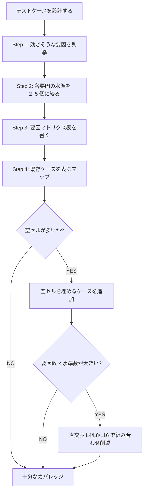

# テスト設計の要因マトリクス skill

テストケース（または evaluation set）を **要因 × 水準のマトリクス** で設計するためのフレーム。

## なぜこの skill が要るか

テストケースを「思いつきで並べる」と、暗黙のうちに以下が起きる：

- 要因が混ざる: 1 ケースに「入力タイプ + 状態 + 並行性 + 期待動作」が同時に変わる → 失敗しても原因が切り分けられない
- 偏りが見えない: ある要因の特定水準だけをテストし続け、他の水準が空白のまま「カバーしている」と誤認
- ケース追加の根拠が薄い: 「もう少し増やすか」が思いつきになり、ケース数が増えるが網羅性は上がらない

要因マトリクスを使うと、これらが構造的に防げる。

## 使うフロー

## Step 1: 要因を列挙する

テストの種類別に、典型的な要因例は `references/factor-examples.md` を参照。代表例：

| テスト種類 | 主な要因 |
| --- | --- |
| unit test の境界値 | 入力タイプ / 値の範囲 / 状態 / null 性 |
| integration test | 認証状態 / データ状態 / 並行性 / 外部依存の応答 |
| LLM trigger eval | 言語 / 文体 / 動詞 / キーワード明示性 / 文の長さ / 期待動作 |
| プロパティテスト | input shape / size / 制約条件 |
| 契約テスト | リクエスト側 / レスポンス側 / エラー変換 / 副作用 / 入力境界 |

要因を列挙する際の判断:
- 「変えたら結果が変わりうる」変数を要因として扱う
- 5〜7 個を超えたら絞る（多すぎると組み合わせ爆発）
- 期待動作（pass/fail, trigger/no-trigger）も 1 要因として扱う

## Step 2: 各要因の水準を絞る

水準は「最小・典型・最大・異常」のように 2〜5 個に絞る。多すぎると組み合わせが爆発し、少なすぎるとカバレッジが粗くなる。

例（LLM trigger eval）:

| 要因 | 水準 |
| --- | --- |
| パターン | sdk-wrap / openapi-no-sdk / no-spec / 隣接ドメイン（負例） |
| 言語 | 日本語のみ / 英語混在 |
| 動詞 | 「書く」「迷ってる」「教えて」「設計したい」 |
| キーワード明示性 | ラッパー/client 明示 / 暗黙 |
| 文の長さ | 短文（1-2 行） / 長文（3-5 行） |
| 期待動作 | trigger / no-trigger |

## Step 3: マトリクス表を書く

要因が 2〜3 個ならフルマトリクスを書ける。要因が 4 個以上なら、表をピボットして見やすい軸を選ぶか、直交表（後述）を使う。

## Step 4: 既存ケースをマップして空セルを発見

各既存ケースを「どの水準を満たしているか」でマップする。Markdown table で十分：

| ケース | パターン | 言語 | 動詞 | 期待動作 |
| --- | --- | --- | --- | --- |
| #1 | sdk-wrap | 日本語 | 「書く」 | trigger |
| #2 | sdk-wrap | 日本語 | 「迷ってる」 | trigger |
| #3 | openapi | 日本語 | 「書く」 | trigger |
| ... | ... | ... | ... | ... |

水準ごとの登場回数をカウントし、極端に少ない水準があれば「失敗時にその水準が原因か判別できない」を疑う。

## 直交表の使いどころ

要因が多くなる時（5 要因以上 × 各水準 3 個以上 = 243 通り など）、フル組み合わせは現実的でない。直交表を使うと「主効果を分離できる最小ケース集合」が得られる。

| 状況 | 推奨 |
| --- | --- |
| 要因 ≤ 3、水準 ≤ 3 | フルマトリクスで OK |
| 要因 4-7、水準 2-3 | L8 / L16 直交表 |
| 要因の交互作用が支配的（LLM eval 等） | 直交表は過剰、要因を意識した「ばらけ」程度に留める |

L4 / L8 / L16 の早見表は `references/orthogonal-array-quickref.md`。

**注意**: 直交表は「要因の効果が独立で線形加算される」前提の道具。LLM の trigger 判定や複雑な相互作用がある対象では、フル直交表に従うと不自然なケースを量産しがち。「要因の意識化」のための補助として使い、教条的に従わない。

## LLM trigger eval 特有の注意点

LLM の trigger eval（skill description が発火するか）の case 設計では、以下の独自要因が効く：

- リアルさ（abstract な質問は trigger しにくい、具体的な状況描写があると trigger しやすい）
- ノイズ（typo / 略語 / casual な口調が混入した時の挙動）
- 隣接ドメインとの境界（trigger すべきでない近接トピックを混ぜる）

詳細は `references/llm-trigger-eval.md`。

## 関連 rule / skill

- `~/.claude/rules/testing.md` — Contract-first / Regression-first テスト方針、本 skill の理論基盤
- `perspective` skill — 視点・視野・視座。テスト設計で水準の粒度を決める時に有用
- `external-api-wrapper-design` skill — 契約テストのチェックリストが要因マトリクスの実例として参照可能
