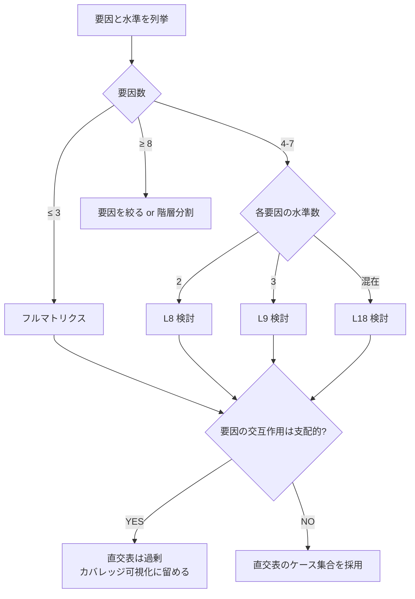

# 直交表クイックリファレンス

要因数が多くなった時に組み合わせを削減するための直交表の早見表。教条的に従うのではなく、要因マトリクスのカバレッジ補助として使う。

## 基本概念

直交表は「どの 2 要因の組み合わせも、各水準ペアが等しく出現する」配置表。これにより**主効果（各要因の単独効果）を分離して観測**できる。

| 表名 | 行数 | 要因数 | 各要因の水準数 | 用途 |
| --- | --- | --- | --- | --- |
| L4 | 4 | 3 | 2 | 簡単なテスト、3 要因 × 2 水準 |
| L8 | 8 | 7 | 2 | 中規模、7 要因 × 2 水準 |
| L9 | 9 | 4 | 3 | 4 要因 × 3 水準 |
| L16 | 16 | 15 | 2 | 大規模、15 要因 × 2 水準 |
| L18 | 18 | 7 | 3（一部 2） | 混合水準 |
| L27 | 27 | 13 | 3 | 大規模、13 要因 × 3 水準 |

## L4（4 要因 × 2 水準想定。実際は 3 要因まで）

要因 A / B / C、各水準は 1 / 2:

| 行 | A | B | C |
| --- | --- | --- | --- |
| 1 | 1 | 1 | 1 |
| 2 | 1 | 2 | 2 |
| 3 | 2 | 1 | 2 |
| 4 | 2 | 2 | 1 |

各水準が 2 回ずつ均等に出現。各 2 要因の組み合わせ（AB、AC、BC）も均等。

## L8（7 要因 × 2 水準）

| 行 | A | B | C | D | E | F | G |
| --- | --- | --- | --- | --- | --- | --- | --- |
| 1 | 1 | 1 | 1 | 1 | 1 | 1 | 1 |
| 2 | 1 | 1 | 1 | 2 | 2 | 2 | 2 |
| 3 | 1 | 2 | 2 | 1 | 1 | 2 | 2 |
| 4 | 1 | 2 | 2 | 2 | 2 | 1 | 1 |
| 5 | 2 | 1 | 2 | 1 | 2 | 1 | 2 |
| 6 | 2 | 1 | 2 | 2 | 1 | 2 | 1 |
| 7 | 2 | 2 | 1 | 1 | 2 | 2 | 1 |
| 8 | 2 | 2 | 1 | 2 | 1 | 1 | 2 |

7 要因 × 2 水準を 8 ケースで評価できる（フル組み合わせは 128 ケース）。

## L9（4 要因 × 3 水準）

| 行 | A | B | C | D |
| --- | --- | --- | --- | --- |
| 1 | 1 | 1 | 1 | 1 |
| 2 | 1 | 2 | 2 | 2 |
| 3 | 1 | 3 | 3 | 3 |
| 4 | 2 | 1 | 2 | 3 |
| 5 | 2 | 2 | 3 | 1 |
| 6 | 2 | 3 | 1 | 2 |
| 7 | 3 | 1 | 3 | 2 |
| 8 | 3 | 2 | 1 | 3 |
| 9 | 3 | 3 | 2 | 1 |

## 使い方の判断フロー

## 直交表が「過剰になる」シーン

- **要因の交互作用が支配的**: 例えば LLM の trigger 判定で「日本語 × ラッパー明示 × 短文」のような組み合わせが特殊な振る舞いをするケース
- **ケースの「リアルさ」が重要**: 直交表に従って組み合わせると、不自然な query になりがち。LLM eval では「実際にユーザーが書きそうな文」が大事
- **要因数が少ない**: 3 要因以下ならフルマトリクスの方が見やすい
- **水準間の差が定性的でなく連続的**: 値の範囲が連続値の場合、直交表より境界値テストの方が向く

これらの場合、直交表を「要因の意識化」のためだけに使い、機械的に従わない。

## 直交表が「ハマる」シーン

- **要因が多く、要因の効果が独立に近い**: ハードウェア試験、回帰テストの境界値網羅
- **コスト 1 ケースが高い**: e2e 全パス、デバイス依存テスト
- **統計的な主効果分析**: A/B テストの設計、QC 活動

## 使う前のチェックリスト

直交表のケース集合を採用する前に：

- [ ] 要因と水準が明確に列挙できているか
- [ ] 要因間の交互作用は無視できる規模か
- [ ] 各 1 ケースの「不自然さ」が許容範囲か
- [ ] 結果分析で「主効果が見たい」のが目的か（フルカバレッジが目的ではないか）

3 つ以上 yes なら直交表が向く。1 つでも no なら、要因マトリクスの可視化として使うに留めるのが安全。

## 参考: 直交表の入手元

- L4 / L8 / L9 / L16 / L18 / L27 / L36 等は QC 教科書・JIS Z 9015 で公開
- 実装ライブラリ: Python の `pyDOE2`, `oapackage` 等
- オンラインジェネレータも複数ある
